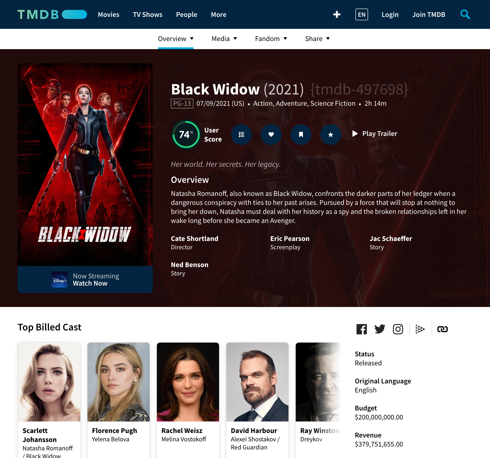
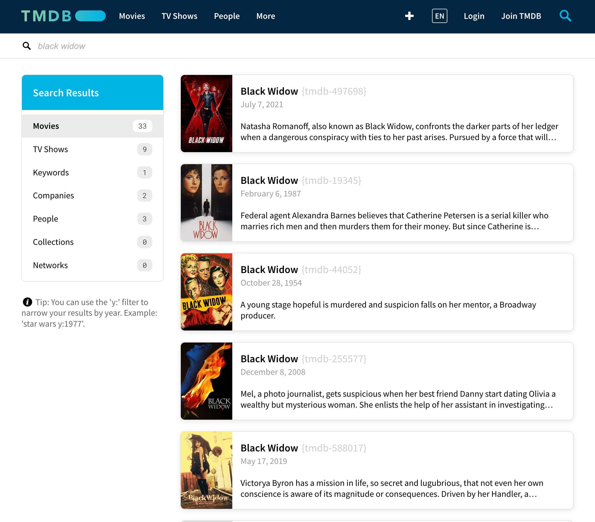

<p align="center"></p>

# tmdb-ids
Chrome extension for easily displaying and copying Tmdb movie ids. Specially useful to pick the ids for following the
Plex [naming convention](https://support.plex.tv/articles/naming-and-organizing-your-movie-media-files/) of movies

It renders the ids in the [detail](https://www.themoviedb.org/movie/497698-black-widow) and
[search](https://www.themoviedb.org/search?query=black%20widow) pages.

By clicking on the rendered id it gets copied to the clipboard.

## Detail Page
<p align="center">


</p>

## Search Page
<p align="center">


</p>

## Installation

1.  Download the repo and build the Chrome extension
    ```bash
    git clone git@bitbucket.org:nass600/tmdb-ids
    cd tmdb-ids
    yarn install
    yarn run build
    ```

2.  Load your extension on Chrome following:
    1.  Access `chrome://extensions/`
    2.  Check `Developer mode`
    3.  Click on `Load unpacked extension`
    4.  Select the `dist` folder.

## License

This project is licensed under the [MIT License](https://opensource.org/licenses/MIT) - see the [LICENSE](LICENSE.md) file for details

## Authors

*   [Ignacio Velazquez](https://ignaciovelazquez.es)
